# 🚄 SNCF Contrôles - Application de Gestion des Contrôles

Application web progressive (PWA) pour la gestion des contrôles voyageurs SNCF, permettant aux agents de saisir et suivre leurs contrôles à bord des trains et en gare.

---

## 📑 Table des matières

1. [Fonctionnalités](#-fonctionnalités)
2. [Technologies](#️-technologies)
3. [Structure du projet](#-structure-du-projet)
4. [Schéma de base de données](#-schéma-de-base-de-données)
5. [Paramètres des contrôles](#-paramètres-des-contrôles)
6. [Types de tarifs détaillés](#-types-de-tarifs-détaillés)
7. [Calcul du taux de fraude](#-calcul-du-taux-de-fraude)
8. [Système de rôles](#-système-de-rôles)
9. [PWA et installation](#-pwa-progressive-web-app)
10. [Déploiement](#-déploiement)

---

## 📱 Fonctionnalités

### 🎫 Saisie des Contrôles

#### Contrôles à Bord
- Sélection du numéro de train avec prédiction intelligente
- Gare d'origine et de destination
- Compteur de voyageurs contrôlés
- Saisie des tarifs de bord (TB) et tarifs de contrôle
- Comptage des STT 50€ et STT 100€
- Liste des PV établis
- Taux de fraude automatique
- Régularisations immédiates (positives/négatives)
- Commentaires libres

#### Contrôles en Gare
- Sélection de la gare et du quai
- Mêmes fonctionnalités que les contrôles à bord
- Adaptation aux spécificités des contrôles fixes

### 📊 Tableau de Bord

- **Statistiques en temps réel:**
  - Total des contrôles (jour/semaine/mois)
  - Voyageurs contrôlés
  - Taux de fraude moyen
  - PV établis
  - Régularisations

- **Graphiques interactifs:**
  - Évolution des contrôles dans le temps
  - Répartition par type (bord/gare)
  - Comparaison des performances

- **Carte de chaleur de la fraude:**
  - Visualisation géographique
  - Identification des zones à risque

### 📜 Historique des Contrôles

- Liste complète des contrôles effectués
- Filtres par date, type, gare/train
- Recherche avancée
- Export des données (CSV, PDF)
- Détail de chaque contrôle
- Modification/suppression (selon permissions)

### 👥 Gestion des Utilisateurs

#### Rôles
- **Agent:** Saisie et consultation de ses propres contrôles
- **Manager:** Consultation de tous les contrôles, statistiques globales
- **Administrateur:** Gestion complète (utilisateurs, configuration, données)

#### Fonctionnalités Admin
- Création/modification/suppression d'utilisateurs
- Attribution des rôles
- Réinitialisation des mots de passe
- Suspension de comptes
- Historique des changements de rôles
- Journal d'audit complet

### 🔔 Notifications

- Alertes de fraude élevée
- Configuration du seuil d'alerte
- Notifications par email aux administrateurs
- Paramètres personnalisables

### 📝 Notes d'Équipe

- Envoi de messages entre agents
- Suivi des notes lues/non lues
- Communication interne simplifiée

---

## 🛠️ Technologies

| Technologie | Version | Utilisation |
|-------------|---------|-------------|
| **React** | ^18.3.1 | Framework frontend |
| **TypeScript** | - | Typage statique |
| **Vite** | - | Build tool |
| **Tailwind CSS** | - | Styles |
| **shadcn/ui** | - | Composants UI |
| **Supabase** | ^2.89.0 | Backend (BDD, Auth, Edge Functions) |
| **TanStack Query** | ^5.83.0 | Gestion des données |
| **React Hook Form** | ^7.61.1 | Formulaires |
| **Zod** | ^3.25.76 | Validation |
| **Recharts** | ^2.15.4 | Graphiques |
| **jsPDF** | ^4.0.0 | Génération PDF |
| **Sonner** | ^1.7.4 | Notifications toast |
| **Lucide React** | ^0.462.0 | Icônes |
| **Vite PWA** | ^1.2.0 | Application installable |

---

## 📁 Structure du Projet

```
src/
├── components/
│   ├── admin/          # Composants admin (audit, sécurité, email)
│   │   ├── AuditLogsTab.tsx
│   │   ├── EmailSettingsCard.tsx
│   │   └── SecurityDashboard.tsx
│   ├── controls/       # Composants de saisie
│   │   ├── CitySelect.tsx        # Sélecteur de gare
│   │   ├── ControlDetailDialog.tsx
│   │   ├── ControlForm.tsx       # Formulaire principal
│   │   ├── ControlsTable.tsx     # Table des contrôles
│   │   ├── Counter.tsx           # Compteur +/-
│   │   ├── ExportFilterDialog.tsx
│   │   ├── GareSelector.tsx
│   │   ├── TarifBordList.tsx     # Liste tarifs de bord
│   │   ├── TarifList.tsx         # Liste tarifs de contrôle
│   │   ├── TrainNumberInput.tsx
│   │   └── TypeToggle.tsx
│   ├── dashboard/      # Tableau de bord
│   │   ├── AgentPerformanceCharts.tsx
│   │   ├── Charts.tsx
│   │   ├── DashboardFilters.tsx
│   │   ├── FraudAlertSettings.tsx
│   │   ├── FraudHeatmap.tsx
│   │   ├── RecentControlsTable.tsx
│   │   └── StatsCard.tsx
│   ├── features/       # Fonctionnalités
│   │   ├── BugReportDialog.tsx
│   │   ├── ReleaseNotesDialog.tsx
│   │   ├── ReportGeneratorDialog.tsx
│   │   └── TeamNotesPanel.tsx
│   ├── layout/         # Layout
│   │   ├── AppLayout.tsx
│   │   ├── Header.tsx
│   │   └── Navigation.tsx
│   └── ui/             # Composants UI shadcn
├── contexts/
│   ├── AuthContext.tsx   # Gestion authentification
│   └── ThemeContext.tsx  # Thème clair/sombre
├── hooks/
│   ├── useSupabaseControls.ts   # CRUD contrôles
│   ├── useFraudNotifications.ts # Alertes fraude
│   ├── useOfflineSync.ts        # Sync hors ligne
│   ├── useConnectionStatus.ts
│   ├── useFormPersistence.ts
│   ├── useHapticFeedback.ts
│   └── ...
├── integrations/
│   └── supabase/
│       ├── client.ts    # Client Supabase
│       └── types.ts     # Types auto-générés
├── pages/
│   ├── Index.tsx           # Page d'accueil
│   ├── LoginPage.tsx       # Connexion
│   ├── Dashboard.tsx       # Tableau de bord
│   ├── OnboardControls.tsx # Contrôles à bord
│   ├── StationControls.tsx # Contrôles en gare
│   ├── ControlHistory.tsx  # Historique
│   ├── Manager.tsx         # Vue manager
│   ├── Admin.tsx           # Administration
│   ├── Settings.tsx        # Paramètres
│   └── NotFound.tsx
└── utils/
    ├── exportControls.ts   # Export CSV/Excel
    └── generateReport.ts   # Génération rapports

supabase/
├── functions/              # Edge Functions
│   ├── create-admin/       # Création admin
│   ├── manage-user/        # Gestion utilisateurs
│   ├── notify-admins/      # Notifications email
│   └── update-user-password/
├── migrations/             # Migrations SQL
└── config.toml             # Configuration
```

---

## 🗄 Schéma de Base de Données

### 📊 Diagramme des Relations

```mermaid
erDiagram
    AUTH_USERS {
        uuid id PK
        string email
        string encrypted_password
        timestamp created_at
    }
    
    PROFILES {
        uuid id PK,FK
        text email
        text full_name
        timestamptz created_at
        timestamptz updated_at
    }
    
    USER_ROLES {
        uuid id PK
        uuid user_id FK
        app_role role
        timestamptz created_at
    }
    
    ONBOARD_CONTROLS {
        uuid id PK
        uuid user_id FK
        text train_number
        text origin
        text destination
        date control_date
        time control_time
        integer passengers
        jsonb tarifs_bord
        jsonb tarifs_controle
        integer stt50_count
        integer stt100_count
        jsonb pv_list
        integer ri_positif
        integer ri_negatif
        text commentaire
        integer fraud_count
        numeric fraud_rate
        timestamptz created_at
    }
    
    STATION_CONTROLS {
        uuid id PK
        uuid user_id FK
        text station_name
        text platform
        text origin
        text destination
        date control_date
        time control_time
        integer passengers
        jsonb tarifs_bord
        jsonb tarifs_controle
        integer stt50_count
        integer stt100_count
        jsonb pv_list
        integer ri_positif
        integer ri_negatif
        text commentaire
        integer fraud_count
        numeric fraud_rate
        timestamptz created_at
    }
    
    USER_PREFERENCES {
        uuid id PK
        uuid user_id FK
        text default_page
        jsonb page_order
        timestamptz created_at
    }
    
    NOTIFICATION_SETTINGS {
        uuid id PK
        uuid user_id FK
        boolean notifications_enabled
        numeric fraud_threshold
        timestamptz created_at
    }
    
    TEAM_NOTES {
        uuid id PK
        uuid author_id FK
        uuid recipient_id FK
        text content
        boolean is_read
        timestamptz created_at
    }
    
    AUDIT_LOGS {
        uuid id PK
        uuid user_id FK
        text table_name
        text action
        uuid record_id
        jsonb old_data
        jsonb new_data
        timestamptz created_at
    }
    
    ROLE_HISTORY {
        uuid id PK
        uuid user_id FK
        uuid changed_by FK
        app_role old_role
        app_role new_role
        timestamptz created_at
    }
    
    BUG_REPORTS {
        uuid id PK
        uuid user_id FK
        text title
        text description
        text status
        text priority
        timestamptz created_at
    }
    
    RELEASE_NOTES {
        uuid id PK
        text version
        text title
        text content
        date release_date
        timestamptz created_at
    }
    
    REPORTS {
        uuid id PK
        uuid user_id FK
        text type
        text nom_gare
        text voie
        text description
        text statut
        timestamptz created_at
    }
    
    ADMIN_FEATURE_SETTINGS {
        uuid id PK
        text feature_key
        boolean enabled
        uuid updated_by FK
        timestamptz updated_at
    }
    
    EMAIL_SETTINGS {
        uuid id PK
        text setting_key
        text setting_value
        uuid updated_by FK
        timestamptz updated_at
    }

    AUTH_USERS ||--|| PROFILES : "has"
    AUTH_USERS ||--o{ USER_ROLES : "has"
    AUTH_USERS ||--o{ ONBOARD_CONTROLS : "creates"
    AUTH_USERS ||--o{ STATION_CONTROLS : "creates"
    AUTH_USERS ||--o| USER_PREFERENCES : "has"
    AUTH_USERS ||--o| NOTIFICATION_SETTINGS : "has"
    AUTH_USERS ||--o{ TEAM_NOTES : "sends"
    AUTH_USERS ||--o{ TEAM_NOTES : "receives"
    AUTH_USERS ||--o{ AUDIT_LOGS : "generates"
    AUTH_USERS ||--o{ ROLE_HISTORY : "subject"
    AUTH_USERS ||--o{ ROLE_HISTORY : "changed_by"
    AUTH_USERS ||--o{ BUG_REPORTS : "submits"
    AUTH_USERS ||--o{ REPORTS : "creates"
    AUTH_USERS ||--o{ ADMIN_FEATURE_SETTINGS : "updates"
    AUTH_USERS ||--o{ EMAIL_SETTINGS : "updates"
```



### 📋 Tables Principales

### Table `onboard_controls` (Contrôles à bord)

| Colonne | Type | Nullable | Défaut | Description |
|---------|------|----------|--------|-------------|
| `id` | UUID | NON | `gen_random_uuid()` | Identifiant unique du contrôle |
| `user_id` | UUID | NON | - | ID de l'utilisateur (ref auth.users) |
| `train_number` | TEXT | NON | - | Numéro du train (ex: TGV8123, TER42001) |
| `origin` | TEXT | NON | - | Gare de départ |
| `destination` | TEXT | NON | - | Gare d'arrivée |
| `control_date` | DATE | NON | - | Date du contrôle (YYYY-MM-DD) |
| `control_time` | TIME | NON | - | Heure du contrôle (HH:MM:SS) |
| `passengers` | INTEGER | NON | `0` | Nombre de passagers contrôlés |
| `tarifs_bord` | JSONB | NON | `'[]'` | Liste des tarifs de bord vendus |
| `tarifs_controle` | JSONB | NON | `'[]'` | Liste des tarifs de contrôle (RNV, STT, etc.) |
| `stt50_count` | INTEGER | NON | `0` | Nombre de STT à 50€ |
| `stt100_count` | INTEGER | NON | `0` | Nombre de STT à 100€ (PV) |
| `pv_list` | JSONB | NON | `'[]'` | Liste des procès-verbaux établis |
| `ri_positif` | INTEGER | NON | `0` | Régularisations immédiates positives |
| `ri_negatif` | INTEGER | NON | `0` | Régularisations immédiates négatives |
| `commentaire` | TEXT | OUI | `''` | Commentaire libre de l'agent |
| `fraud_count` | INTEGER | NON | `0` | Nombre total de fraudes détectées |
| `fraud_rate` | NUMERIC | NON | `0` | Taux de fraude calculé (%) |
| `created_at` | TIMESTAMPTZ | NON | `now()` | Date de création |
| `updated_at` | TIMESTAMPTZ | NON | `now()` | Date de dernière modification |

### Table `station_controls` (Contrôles en gare)

| Colonne | Type | Nullable | Défaut | Description |
|---------|------|----------|--------|-------------|
| `id` | UUID | NON | `gen_random_uuid()` | Identifiant unique du contrôle |
| `user_id` | UUID | NON | - | ID de l'utilisateur |
| `station_name` | TEXT | NON | - | Nom de la gare (ex: Paris Gare de Lyon) |
| `platform` | TEXT | NON | - | Numéro de quai (ex: Voie 12) |
| `origin` | TEXT | NON | - | Provenance du train contrôlé |
| `destination` | TEXT | NON | - | Destination du train contrôlé |
| `control_date` | DATE | NON | - | Date du contrôle |
| `control_time` | TIME | NON | - | Heure du contrôle |
| `passengers` | INTEGER | NON | `0` | Nombre de passagers contrôlés |
| `tarifs_bord` | JSONB | NON | `'[]'` | Liste des tarifs de bord |
| `tarifs_controle` | JSONB | NON | `'[]'` | Liste des tarifs de contrôle |
| `stt50_count` | INTEGER | NON | `0` | Nombre de STT à 50€ |
| `stt100_count` | INTEGER | NON | `0` | Nombre de STT à 100€ |
| `pv_list` | JSONB | NON | `'[]'` | Liste des PV |
| `ri_positif` | INTEGER | NON | `0` | RI positives |
| `ri_negatif` | INTEGER | NON | `0` | RI négatives |
| `commentaire` | TEXT | OUI | `''` | Commentaire |
| `fraud_count` | INTEGER | NON | `0` | Nombre de fraudes |
| `fraud_rate` | NUMERIC | NON | `0` | Taux de fraude (%) |
| `created_at` | TIMESTAMPTZ | NON | `now()` | Création |
| `updated_at` | TIMESTAMPTZ | NON | `now()` | Modification |

### Table `profiles` (Profils utilisateurs)

| Colonne | Type | Nullable | Défaut | Description |
|---------|------|----------|--------|-------------|
| `id` | UUID | NON | - | ID utilisateur (référence auth.users) |
| `email` | TEXT | OUI | - | Email de l'utilisateur |
| `full_name` | TEXT | OUI | - | Nom complet affiché |
| `created_at` | TIMESTAMPTZ | NON | `now()` | Date de création du profil |
| `updated_at` | TIMESTAMPTZ | NON | `now()` | Date de mise à jour |

### Table `user_roles` (Rôles utilisateurs)

| Colonne | Type | Nullable | Défaut | Description |
|---------|------|----------|--------|-------------|
| `id` | UUID | NON | `gen_random_uuid()` | Identifiant unique |
| `user_id` | UUID | NON | - | ID de l'utilisateur |
| `role` | app_role | NON | - | Rôle attribué (admin, manager, agent) |

---

## 📋 Paramètres des Contrôles

### Informations Générales

| Paramètre | Type | Format | Description | Exemple |
|-----------|------|--------|-------------|---------|
| **Numéro de train** | Texte | Alphanumérique | Identifiant unique du train | `TGV8123`, `TER42001`, `OUIGO7890` |
| **Gare origine** | Texte | Nom complet | Gare de départ du trajet | `Paris Gare de Lyon` |
| **Gare destination** | Texte | Nom complet | Gare d'arrivée du trajet | `Lyon Part-Dieu` |
| **Date** | Date | YYYY-MM-DD | Date du contrôle | `2026-01-11` |
| **Heure** | Heure | HH:MM | Heure du contrôle | `14:30` |
| **Passagers** | Entier | ≥ 0 | Nombre de voyageurs contrôlés | `45` |

### Compteurs Spéciaux

| Paramètre | Description | Montant unitaire | Compte comme fraude |
|-----------|-------------|------------------|---------------------|
| **stt50Count** | Sans Titre de Transport à 50€ | 50€ | ✅ Oui |
| **stt100Count** | Sans Titre de Transport à 100€ (PV) | 100€ | ✅ Oui |
| **riPositif** | Régularisation Immédiate Positive | Variable | ❌ Non |
| **riNegatif** | Régularisation Immédiate Négative | Variable | ❌ Non |

### Commentaire

| Paramètre | Type | Limite | Description |
|-----------|------|--------|-------------|
| **commentaire** | Texte | Illimité | Notes libres de l'agent (incidents, observations) |

---

## 💰 Types de Tarifs Détaillés

### Tarifs de Contrôle (tarifsControle)

Les tarifs de contrôle sont des régularisations établies lors du contrôle pour des infractions.

| Type | Code | Description | Compte comme fraude |
|------|------|-------------|---------------------|
| **STT** | STT | Sans Titre de Transport - Voyageur sans billet | ✅ Oui |
| **RNV** | RNV | Régularisation Non Valable - Titre non conforme | ✅ Oui |
| **Titre tiers** | Titre tiers | Utilisation du titre d'une autre personne | ✅ Oui |
| **D. naissance** | D. naissance | Date de naissance non conforme (réduction abusive) | ✅ Oui |
| **Autre** | Autre | Autre type d'infraction tarifaire | ✅ Oui |

**Structure JSON :**
```typescript
interface TarifItem {
  id: number;        // Identifiant unique auto-incrémenté
  type: 'STT' | 'RNV' | 'Titre tiers' | 'D. naissance' | 'Autre';
  montant: number;   // Montant en euros (ex: 35.50)
}

// Exemple:
[
  { id: 1, type: 'RNV', montant: 35 },
  { id: 2, type: 'STT', montant: 50 },
  { id: 3, type: 'D. naissance', montant: 25 }
]
```

### Tarifs de Bord (tarifsBord)

Les tarifs de bord sont des ventes effectuées directement à bord du train.

| Type | Description |
|------|-------------|
| **bord** | Tarif de bord standard - Vente normale à bord |
| **exceptionnel** | Tarif exceptionnel - Cas particuliers |

**Structure JSON :**
```typescript
interface TarifBordItem {
  id: number;           // Identifiant unique
  montant: number;      // Montant en euros
  description?: string; // Description optionnelle
  tarifType: 'bord' | 'exceptionnel';
}

// Exemple:
[
  { id: 1, montant: 45.00, tarifType: 'bord', description: 'Paris-Lyon' },
  { id: 2, montant: 120.00, tarifType: 'exceptionnel', description: 'Surclassement 1ère' }
]
```

### Procès-Verbaux (pvList)

Les PV sont établis pour les infractions graves ou récidivistes.

**Structure JSON :**
```typescript
interface TarifItem {
  id: number;        // Identifiant unique
  type: string;      // Type de PV (libre)
  montant: number;   // Montant de l'amende
}

// Exemple:
[
  { id: 1, type: 'Fraude habituelle', montant: 150 },
  { id: 2, type: 'Refus de régularisation', montant: 100 }
]
```

---

## 📈 Calcul du Taux de Fraude

### Formule du Nombre de Fraudes

Le nombre de fraudes est calculé automatiquement à la sauvegarde :

```typescript
// Calcul du nombre total de fraudes pour un contrôle
fraudCount = 
  tarifsControle.length +   // Chaque tarif de contrôle = 1 fraude
  stt50Count +              // Chaque STT 50€ = 1 fraude
  stt100Count +             // Chaque STT 100€ = 1 fraude
  pvList.length             // Chaque PV = 1 fraude

// Exemple:
// tarifsControle: [RNV, D.naissance] = 2
// stt50Count: 3
// stt100Count: 1
// pvList: [PV1] = 1
// Total fraudCount = 2 + 3 + 1 + 1 = 7 fraudes
```

### Formule du Taux de Fraude Individuel

Pour chaque contrôle, le taux est calculé ainsi :

```typescript
// Taux de fraude par contrôle (en pourcentage)
fraudRate = passengers > 0 
  ? (fraudCount / passengers) * 100 
  : 0

// Exemple:
// passengers = 50
// fraudCount = 7
// fraudRate = (7 / 50) * 100 = 14.0%
```

### Formule du Taux de Fraude Global (Dashboard)

Le tableau de bord agrège tous les contrôles :

```typescript
// Calcul des totaux sur tous les contrôles
const totalPassengers = 
  onboardControls.reduce((sum, c) => sum + c.passengers, 0) +
  stationControls.reduce((sum, c) => sum + c.passengers, 0);

const totalFrauds = 
  onboardControls.reduce((sum, c) => sum + c.fraudCount, 0) +
  stationControls.reduce((sum, c) => sum + c.fraudCount, 0);

// Taux de fraude global
const fraudRate = totalPassengers > 0 
  ? (totalFrauds / totalPassengers) * 100 
  : 0;

// Exemple global:
// 10 contrôles à bord: 500 passagers, 35 fraudes
// 5 contrôles en gare: 200 passagers, 12 fraudes
// Total: 700 passagers, 47 fraudes
// Taux global = (47 / 700) * 100 = 6.71%
```

### Calcul des Montants Totaux

```typescript
// Total des tarifs de contrôle (régularisations)
const totalTarifsControle = 
  tarifsControle.reduce((sum, t) => sum + t.montant, 0) +
  (stt50Count * 50);  // STT 50€ ajoutés

// Total des PV
const totalPV = 
  pvList.reduce((sum, t) => sum + t.montant, 0) +
  (stt100Count * 100);  // STT 100€ ajoutés

// Total des ventes à bord
const totalTarifsBord = 
  tarifsBord.reduce((sum, t) => sum + t.montant, 0);

// Exemple de revenus:
// tarifsControle: [{montant: 35}, {montant: 50}] = 85€
// stt50Count: 3 × 50€ = 150€
// Total régularisations = 85 + 150 = 235€
```

### Indicateurs du Dashboard

| Indicateur | Formule | Description |
|------------|---------|-------------|
| **Contrôles à bord** | `onboardControls.length` | Nombre total de contrôles à bord |
| **Contrôles en gare** | `stationControls.length` | Nombre total de contrôles en gare |
| **Total passagers** | `Σ passengers` | Somme de tous les passagers |
| **Taux de fraude** | `(Σ fraudCount / Σ passengers) × 100` | Pourcentage global |
| **Couleur alerte** | `> 5%` = rouge, `> 2%` = orange, sinon vert | Code couleur visuel |

---

## 🎭 Système de Rôles

### Enum `app_role`

```sql
CREATE TYPE public.app_role AS ENUM ('admin', 'manager', 'agent');
```

### Permissions par Rôle

| Permission | Agent | Manager | Admin |
|------------|-------|---------|-------|
| Voir ses propres contrôles | ✅ | ✅ | ✅ |
| Créer des contrôles | ✅ | ✅ | ✅ |
| Modifier ses contrôles | ✅ | ✅ | ✅ |
| Supprimer ses contrôles | ✅ | ✅ | ✅ |
| Voir tous les contrôles | ❌ | ✅ | ✅ |
| Voir les statistiques globales | ❌ | ✅ | ✅ |
| Gérer les utilisateurs | ❌ | ❌ | ✅ |
| Attribuer des rôles | ❌ | ❌ | ✅ |
| Voir les logs d'audit | ❌ | ❌ | ✅ |
| Configurer les alertes email | ❌ | ❌ | ✅ |
| Accès au tableau de sécurité | ❌ | ❌ | ✅ |

### Fonction de Vérification

```sql
CREATE FUNCTION public.has_role(_user_id UUID, _role app_role)
RETURNS BOOLEAN
LANGUAGE SQL
STABLE
SECURITY DEFINER
SET search_path = public
AS $$
  SELECT EXISTS (
    SELECT 1 FROM public.user_roles
    WHERE user_id = _user_id AND role = _role
  )
$$;
```

---

## 📱 PWA (Progressive Web App)

### Fonctionnalités PWA

- ✅ Installation sur l'écran d'accueil
- ✅ Mode hors-ligne (données en cache)
- ✅ Synchronisation automatique
- ✅ Icône SNCF personnalisée
- ✅ Splash screen au démarrage

### Installation sur Mobile

**iOS (Safari):**
1. Ouvrir l'application dans Safari
2. Appuyer sur le bouton Partager (carré avec flèche)
3. Sélectionner "Sur l'écran d'accueil"
4. Confirmer l'ajout

**Android (Chrome):**
1. Ouvrir l'application dans Chrome
2. Appuyer sur le menu (⋮)
3. Sélectionner "Installer l'application"
4. Confirmer

### Installation sur Desktop

**Chrome/Edge:**
1. Ouvrir l'application
2. Cliquer sur l'icône d'installation dans la barre d'adresse
3. Confirmer l'installation

---

## 🚀 Déploiement

### Prérequis

- Node.js 18+
- npm ou bun

### Installation Locale

```bash
# Cloner le repository
git clone <YOUR_GIT_URL>

# Installer les dépendances
npm install

# Lancer en développement
npm run dev

# Build de production
npm run build
```

### Variables d'Environnement

Les variables sont automatiquement configurées par Lovable Cloud :

```env
VITE_SUPABASE_URL=https://hpbkpsofyxlacnskeukv.supabase.co
VITE_SUPABASE_PUBLISHABLE_KEY=eyJhbGciOiJIUzI1NiIs...
VITE_SUPABASE_PROJECT_ID=hpbkpsofyxlacnskeukv
```

---

## 📊 Pages de l'Application

| Route | Page | Description | Accès |
|-------|------|-------------|-------|
| `/` | Accueil | Page de connexion/redirection | Public |
| `/login` | Connexion | Formulaire de connexion | Public |
| `/dashboard` | Tableau de bord | Statistiques et graphiques | Authentifié |
| `/onboard` | Contrôles à bord | Saisie des contrôles train | Authentifié |
| `/station` | Contrôles en gare | Saisie des contrôles gare | Authentifié |
| `/history` | Historique | Liste de tous les contrôles | Authentifié |
| `/settings` | Paramètres | Configuration utilisateur | Authentifié |
| `/manager` | Gestion équipe | Vue manager avancée | Manager+ |
| `/admin` | Administration | Gestion utilisateurs, audit | Admin |

---

## 🔐 Sécurité

- ✅ Authentification via Supabase Auth
- ✅ Row Level Security (RLS) sur toutes les tables
- ✅ Chaque utilisateur ne voit que ses propres données
- ✅ Les admins/managers peuvent voir toutes les données
- ✅ Chiffrement HTTPS en transit
- ✅ Mots de passe hashés
- ✅ Journal d'audit des actions sensibles

---

## 📞 Support

Pour signaler un bug ou proposer une amélioration :
1. Utilisez le bouton "Signaler un bug" dans l'application
2. Ou créez une issue sur le repository

---

## 📄 Licence

Application développée pour SNCF - Usage interne.

---

*Dernière mise à jour: Janvier 2026*
